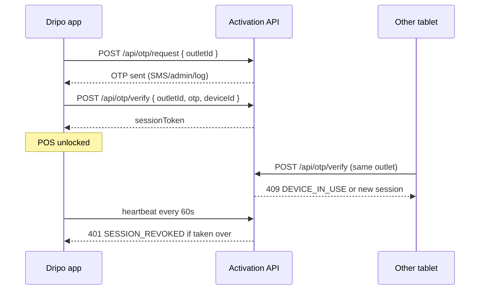

# Device activation (OTP) — setup guide

Dripo can run on **only one device per outlet** at a time. A second tablet must enter an OTP to take over; the first device is signed out automatically.

---

## How it works



| Step | User action | System |
|------|-------------|--------|
| 1 | Open app | If not licensed → **Activate device** screen |
| 2 | Enter outlet code (e.g. `DRIPO-01`) | Identifies the store license |
| 3 | Tap **Send OTP** | Server creates a short-lived OTP |
| 4 | Enter OTP → **Activate** | Server binds outlet → this `deviceId` |
| 5 | Use POS normally | Heartbeat every 60 seconds |
| 6 | Another device activates same outlet | Previous device gets **signed out** on next heartbeat |

---

## Quick start (development)

### 1. Start the activation API

```bash
cd backend/device-activation
node server.mjs
```

You should see:

```text
Dripo activation API on http://0.0.0.0:8787
```

When you request an OTP, the code is printed in this terminal (for testing).

### 2. Point the app at the server

Create a file `.env` in the **project root** (same folder as `package.json`):

```env
EXPO_PUBLIC_ACTIVATION_API_URL=http://192.168.1.10:8787
```

| Important | Detail |
|-----------|--------|
| Use LAN IP | Replace `192.168.1.10` with your PC’s IP on Wi‑Fi |
| Not `localhost` | The phone/emulator must reach the PC over the network |
| Restart Expo | Stop and run `npx expo start` again after changing `.env` |

Find your PC IP (Windows): `ipconfig` → IPv4 Address.

### 3. Activate on the device

1. Open Dripo → **Activate device**
2. Outlet code: `DRIPO-01` (any code works in dev)
3. **Send OTP** → check the terminal for the 6-digit code
4. Enter OTP → **Activate this device**

### 4. Test single-device rule

1. Activate on tablet A
2. On tablet B, try the same outlet code + new OTP  
   → Should show **already active on another device** (or take over after A signs out)

---

## Development without a server

If `EXPO_PUBLIC_ACTIVATION_API_URL` is **empty**:

- OTP is always **`123456`**
- License is stored **only on this device** (not secure; for local testing only)

---

## App settings (after activation)

**Settings → Device license**

- View outlet code, device name, activation time  
- **Sign out this device** — frees the license so another tablet can activate

---

## API contract (production backend)

Your server should implement these endpoints (same as `backend/device-activation/server.mjs`):

### `POST /api/otp/request`

```json
{ "outletId": "DRIPO-01" }
```

Response `200`:

```json
{ "ok": true }
```

In dev/demo, you may return `{ "devOtp": "482910" }` for testing.  
In production, send OTP via SMS/WhatsApp/email and **do not** return the code in the response.

### `POST /api/otp/verify`

```json
{
  "outletId": "DRIPO-01",
  "otp": "482910",
  "deviceId": "uuid-from-app",
  "deviceName": "Dripo a1b2c3d4"
}
```

Success `200`:

```json
{ "sessionToken": "hex-string", "outletId": "DRIPO-01" }
```

Conflict `409` (another device is active):

```json
{
  "code": "DEVICE_IN_USE",
  "message": "Outlet active on another device.",
  "activeDeviceName": "Dripo x9y8z7w6"
}
```

Invalid OTP `400`:

```json
{ "code": "INVALID_OTP", "message": "Invalid or expired OTP." }
```

### `POST /api/session/heartbeat`

```json
{ "sessionToken": "...", "deviceId": "..." }
```

- `200` → session still valid  
- `401` + `SESSION_REVOKED` → another device took over; app returns to activation screen

### `POST /api/session/release`

```json
{ "sessionToken": "...", "deviceId": "..." }
```

Call when user taps **Sign out** on Device license screen.

---

## Production checklist

- [ ] HTTPS only (TLS certificate)
- [ ] OTP expires in 5–10 minutes
- [ ] Rate-limit `/otp/request` per outlet (prevent abuse)
- [ ] Store `outletId → { deviceId, sessionToken, deviceName, lastSeen }` in a database
- [ ] Real OTP delivery (Twilio, WhatsApp Business API, etc.)
- [ ] Admin panel to generate codes and see active device
- [ ] Do **not** ship with dev OTP `123456` or empty API URL

---

## Environment variables

| Variable | Required | Example |
|----------|----------|---------|
| `EXPO_PUBLIC_ACTIVATION_API_URL` | Production yes | `https://api.yourdomain.com` |

Expo reads this at build/start time. For EAS builds, set it in **EAS Secrets** or `eas.json` env.

---

## Troubleshooting

| Problem | Fix |
|---------|-----|
| “Cannot reach activation server” | Check URL, same Wi‑Fi, firewall allows port 8787 |
| OTP never arrives (production) | Check SMS provider logs; verify outlet exists |
| App keeps asking to activate | Heartbeat failed — sign in again; check server session store |
| Two devices both work | API not deployed; you are in dev `123456` mode |

---

## Related files

| Path | Purpose |
|------|---------|
| `app/activation.tsx` | Activation UI |
| `store/useActivationStore.ts` | Session persistence |
| `services/deviceActivationApi.ts` | HTTP client |
| `hooks/useDeviceSessionGuard.ts` | Heartbeat + redirect |
| `backend/device-activation/server.mjs` | Reference server |
